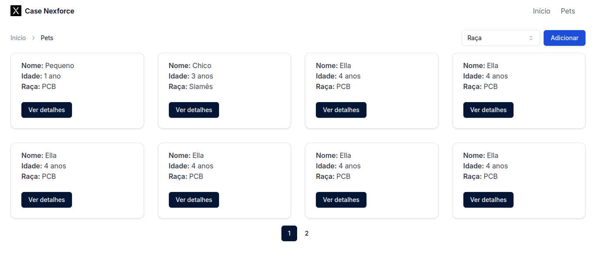
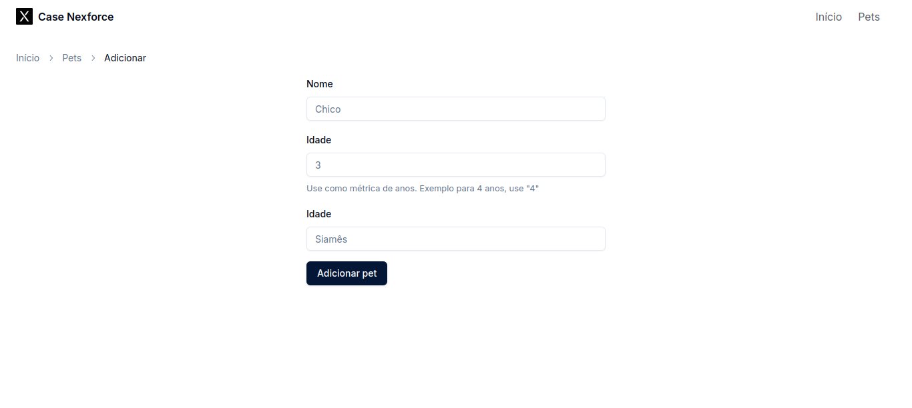

# Case Nexforce Matheus Oliveira

<table>
<tr>
<td>

**Case Nexforce Matheus Oliveira** é uma solução web desenvolvido em TypeScript e Python com integração ao HubSpot para um caso de estudo oferecido pela Nexforce. A aplicação utiliza uma arquitetura contendo um back-end, uma SPA no front-end e um script de análise de dados. A arquitetura da aplicação é explicada na seção de [Arquitetura](#Arquitetura).

</td>
</tr>
</table>

**Screenshots**

<div>
  
  
</div>

## Tecnologias

Foi utilizado para o front-end:
 - ReactJS
 - TailwindCSS (como framework CSS)
 - Radix (componentes com acessibilidade)

Para o back-end é utilizado:
 - ExpressJS
 - PrismaORM
 - HubSpot API
 - Vitest (como ferramente de testes)

## Como configurar

### Back-end

Acesse a pasta `apps/apirestful`

#### Ambiente de execução

Configure as variáveis de ambiente copiando o conteúdo do arquivo `.env.sample` para um novo arquivo `.env`.

```env
HUBSPOT_TOKEN=<hubspot-token>

POSTGRES_USER=<db_user>
POSTGRES_PASSWORD=<db_password>
POSTGRES_DB=<db_name>

DATABASE_URL=postgresql://<db_user>:<db_password>@localhost:5432/<db_name>?schema=<db_schema>
```

**Observação**: Defina os valores para as variáveis de ambiente com valor predefinido com o padrão `<variavel>`

#### Configuração de containers

**Observação**: Use Docker Compose v2

```bash
docker compose up -d
```

#### Preparar back-end

Instale as dependeências do projeto:

```bash
pnpm i
```

#### Configuração do banco de dados

Execute as migrações em desenvolvimento:

```bash
pnpm prisma migrate dev
```

#### Teste a API RESTful com HTTPie

Instale o HTTPie (Ubuntu/Debian derivados):

```bash
sudo apt install httpie
```

**IMPORTANTE**: Leia a [documentação](https://httpie.io/docs/cli/single-binary-executables) para instalar em distros diferente de Ubuntu/Debian derivados

Execute uma requição `GET /pet`:

```bash
http GET localhost:5000/pet
```

Rode os testes unitários:

```bash
pnpm test
```

#### Execute a aplicação em desenvolvimento

Instale as dependências:

```bash
pnpm install
```

Execute em desenvolvimento:

```bash
pnpm dev
```

Pronto! A aplicação está pronta para ser utilizada em desenvolvimento. Disponível na porta **5000**.

#### Executar a aplicação em produção

Compile o código em TypeScript para um JavaScript prepadado e otimizado para ambiente de produção:

```bash
pnpm build
```

Execute o comando para a aplicação em produção

```bash
pnpm prod
```

A aplicação está disponível na porta **5000**

### Front-end

Acesse a pasta `apps/spa`

#### Ambiente de execução

Configure as variáveis de ambiente copiando o conteúdo do arquivo `.env.sample` para um novo arquivo `.env`.

```env
VITE_SERVER_BASE_URL=http://localhost:5000
```

#### Executar a aplicação em desenvolvimento

Instale as dependências:

```bash
pnpm install
```

Execute em desenvolvimento:

```bash
pnpm dev
```

**Observação**: Garanta que a aplicação Back-end esteja rodando e funcionando para o Front-end funcionar adequadamente.

Pronto! A aplicação está pronta para ser utilizada em desenvolvimento

#### Executar a aplicação em produção

Compile o código em TypeScript para um JavaScript prepadado e otimizado para ambiente de produção:

```bash
pnpm build
```

Execute o comando para a aplicação em produção

```bash
pnpm preview
```

A aplicação está disponível na porta **3000**