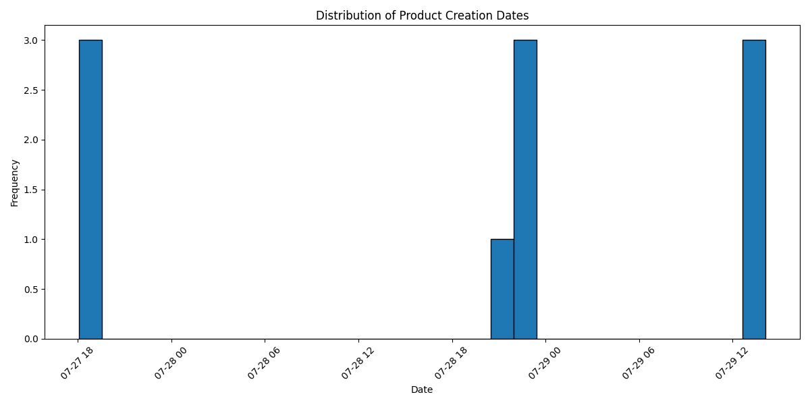

#Sobre o projeto:

- Frontend: Construído em ReactJS + Tailwind (para construção rápida, eficiente e responsiva dos seus componentes)
- Backend: Construído em NodeJs + Express + conexão com hubspot (criação de app privado com operações de PUT, DELETE, PATCH, GET dentre a API e o APP)
- Script: Construído em Python, o script faz a análise dos dados inseridos por data. Verifico quando os produtos foram criados
e identifico possíveis padrões. Em seguida, ploto um gráfico de barras mostrando a distribuição de produtos por data (conectado ao hubspot)
- Banco de dados: A API foi conectada com um banco de dados local (MongoDB), os dados enviados do front são recebidos tanto no hubspot quanto no mongo.

#Como rodar o projeto: 

- Instale os requirements de cada projeto (front e back) | cd frontend -> npm install | cd backend -> npm install |
- Crie e ative sua venv para rodar o script python (lembrando que o back deve estar rodando enquanto isso) | cd scripts -> .\.venv\Scripts\activate -> python script_data.py 
- Para rodar a API | nodemon start

app.use(cors({
  origin: '<SEU_ENDEREÇO_FRONT>'
}));

- Para rodar a Interface | npm run dev
- Para rodar o script | python script_data.py
- Para roddar testes | npm test
- Você pode configurar seu próprio banco MongoDB para verificar os dados sendo enviados, conecte-o com a API via mongoose (já instalado)

#O hubspot:

- O hubspot está configurado de acordo com uma conta teste de desenvolvedor (Você deve substituir a HUBSPOT_API_KEY para autenticação). Neste ponto, 
é interessante, ou criar sua própria conta teste e substituir as URL's (passando os mesmos objetos) ou solicitando acesso de equipe. 

url = 'https://api.hubapi.com/crm/v3/objects/<SEU_HUBSPOT_PRIVATE_APP>'

const HUBSPOT_API_KEY = process.env.<SEU_HUBSPOT_API_KEY>;
const hubspotPrivateApp = axios.create({
    baseURL: 'https://api.hubapi.com',
    headers: {
        'Content-Type': 'application/json',
        'Authorization': `Bearer ${HUBSPOT_API_KEY}`
    }
})

- Você pode conectar com um banco local ou não, com a configuração do hubspot, os dados já são enviados para tal, hoje, por questão de segurança, são 
enviados também para o banco.

const connectDB = async () => {
    try {
        const connect = await mongoose.connect(process.env.<SEU_MONGO_URI>) 
        console.log(`MongoDB Connected: ${connect.connection.host}`)
    } catch (error) {
        console.error(`Error to connect: ${error.message}`)
        process.exit(1)
    }
}

#Arquivos gerados pela análise de dados:

-[Arquivo Csv](./backend/scripts/data.csv)

-[Arquivo Json](./backend/scripts/data.json)

